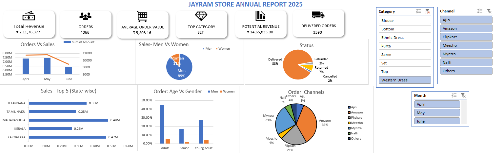

# Retail Sales Performance Analysis 📊

Hey there! Welcome to my Retail Sales Performance Analysis project. This is an Excel-based dashboard I built to analyze sales data and extract actionable insights for a retail store (JayRam Store).

## What's in here? 🔍
* The Dashboard: A clear and interactive Excel dashboard showcasing key performance indicators (KPIs) like revenue, order trends, and demographics.
* The Data: The raw source data used for this analysis is included directly within the Excel file itself (`JayRam Store Data Analysis(JayRam Store).xlsx`).

## A Peek at the Dashboard 📸

## Key Findings 💡
Based on the data analysis, here are a couple of major insights:
1. Women are the Primary Revenue Drivers: Women customers spend approximately **1.8x more** than men. They currently represent the highest ROI segment for marketing and inventory investments.
2. Growth Opportunity in the Men's Segment: The men's segment is under-penetrated compared to overall sales. While women-focused offers drive immediate short-term revenue, analyzing male buying behavior and expanding the men's product mix is a strategic step for long-term growth.

## How to check it out? 🛠️
1. Download the `JayRam Store Data Analysis(JayRam Store).xlsx` file.
2. Open it in Microsoft Excel.
3. Explore the dashboard sheet to interact with the visualizations and see the insights.

What's my uniqueness? 
* Added predictive forecasting to estimate future sales trends.
* Incorporated automated data refresh pipelines if connected to a live database.
